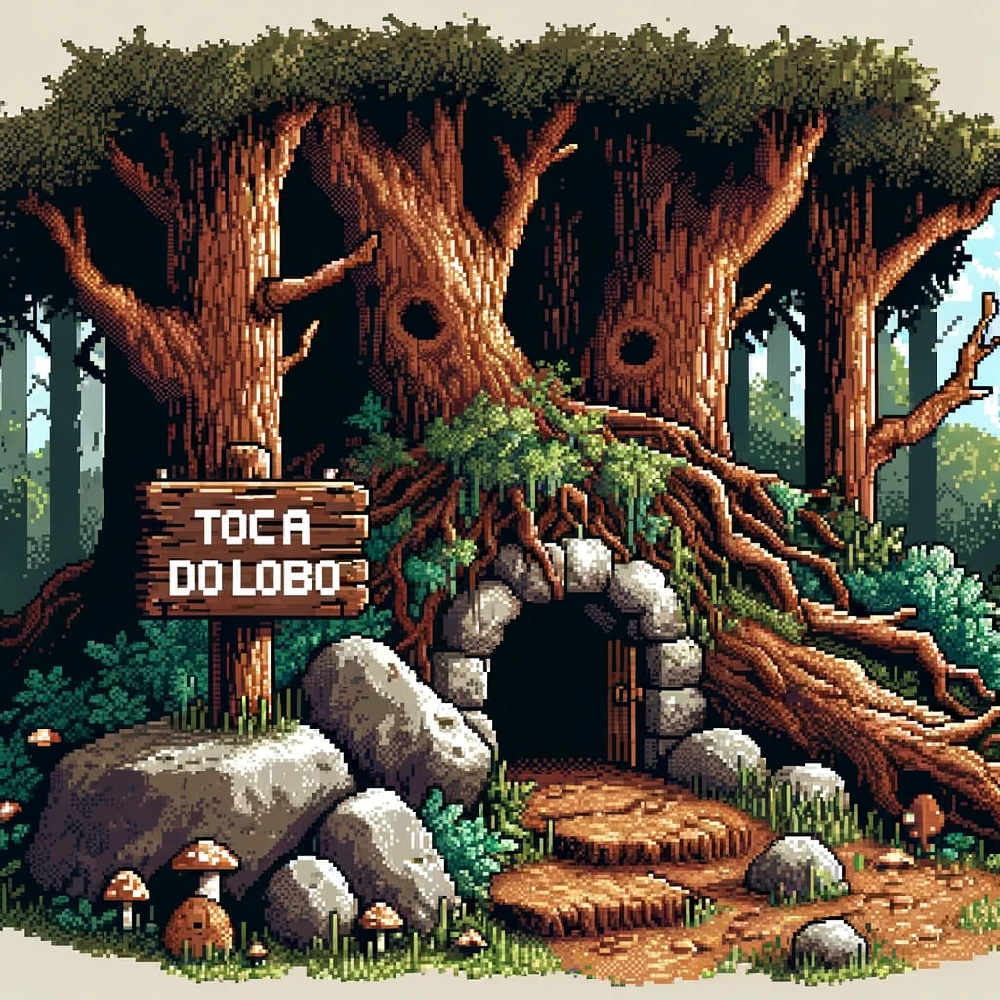

# Porksville - Demo

### Project iniciative by Matheus Estrella, João Romão, Victor Oliveira, Maria Eduarda Souza e Leonardo Caseri

## Main Character

This is the brave hero to be developed in the game.

## Ambient Objetcs

This are the native weapons inspired for the game

When Buriti saves the elemental from a Pork henchman, they are updraged to this weapons

## Screen Images

This images will appear in dialog sections

